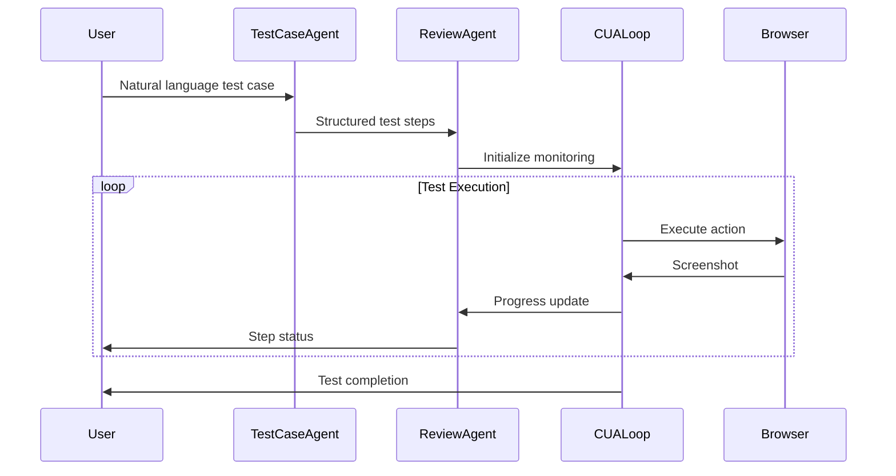

**AGENTS.md**

```markdown
# Testing Agents Architecture

This document describes the AI agents powering the mobile and desktop testing automation system using OpenAI's Computer Use Assistant (CUA) model.

## 🤖 Agent Overview

The testing system employs multiple specialized AI agents that work together to create, execute, and monitor automated tests across mobile and desktop platforms.

### Agent Architecture

```
┌─────────────────────────────────────────────────────────────┐
│                    OpenAI CUA Model                        │
├─────────────────────────────────────────────────────────────┤
│  ┌─────────────────┐  ┌─────────────────┐  ┌─────────────────┐ │
│  │ Test Case Agent │  │ CUA Loop Agent  │  │ Review Agent    │ │
│  └─────────────────┘  └─────────────────┘  └─────────────────┘ │
├─────────────────────────────────────────────────────────────┤
│              Device & Platform Management                   │
│  ┌─────────────────┐  ┌─────────────────┐  ┌─────────────────┐ │
│  │ Mobile Manager  │  │ Action Handler  │  │ Login Service   │ │
│  └─────────────────┘  └─────────────────┘  └─────────────────┘ │
├─────────────────────────────────────────────────────────────┤
│                    Playwright Browser Layer                 │
└─────────────────────────────────────────────────────────────┘
```

## 🎯 Core Agents

### 1. Test Case Agent

**Location**: `cua-server/src/agents/test-case-agent.ts`

**Purpose**: Converts natural language test instructions into structured, executable test steps.

**Key Features**:
- Natural language processing of test requirements
- Structured JSON test case generation
- Platform-aware step creation (mobile vs desktop)
- Login flow detection and integration

**Input Example**:
```
Purchase 2 clothing items: a green shirt and striped polo under $50.
Navigate to clothes section, filter by Men, add items to cart, and checkout.
```

**Output Structure**:
```typescript
interface TestCase {
  steps: Array<{
    step_number: number;
    step_instructions: string;
    status: "pending" | "Pass" | "Fail";
  }>;
}
```

**Model Configuration**:
- **Model**: `o3-mini`
- **API**: OpenAI Responses API with structured output
- **Schema Validation**: Zod schema enforcement

**Usage**:
```typescript
const testCaseAgent = new TestCaseAgent(loginRequired);
const testCase = await testCaseAgent.invokeResponseAPI(userInstruction);
```

### 2. Test Script Review Agent

**Location**: `cua-server/src/agents/test-script-review-agent.ts`

**Purpose**: Monitors test execution progress and evaluates step completion status through visual analysis.

**Key Features**:
- Screenshot analysis for step validation
- Sequential task queue processing
- State persistence across test execution
- Visual progress tracking
- Artifact generation (screenshots of completed steps)

**Workflow**:
1. **Initialization**: Creates test script state from instructions
2. **Monitoring**: Analyzes screenshots to determine step completion
3. **Status Updates**: Updates step status (pending → Pass/Fail)
4. **Artifact Storage**: Saves screenshots when steps transition

**Model Configuration**:
- **Model**: `gpt-4o` (optimized for vision tasks)
- **API**: OpenAI Responses API with image input
- **Context Maintenance**: Previous response chaining

**Queue Management**:
```typescript
interface Task {
  base64Image: string;
  userInstruction?: string;
  resolve: (value: any) => void;
  reject: (error: any) => void;
}
```

**Usage**:
```typescript
const reviewAgent = new TestScriptReviewAgent();
await reviewAgent.instantiateAgent(instructions);
const status = await reviewAgent.checkTestScriptStatus(screenshot);
```

### 3. Computer Use Loop Agent

**Location**: `cua-server/src/lib/computer-use-loop.ts`

**Purpose**: Executes the main automation loop, translating CUA model decisions into browser actions.

**Key Features**:
- Real-time action execution
- Screenshot feedback loop
- Error handling and recovery
- Multi-tab management
- Safety check enforcement

**Action Types**:
```typescript
// Desktop Actions
- click: { x, y, button }
- double_click: { x, y, button }
- type: { text }
- keypress: { keys }
- scroll: { x, y, scrollX, scrollY }
- drag: { path }

// Mobile Actions  
- tap: { x, y }
- double_tap: { x, y }
- long_press: { x, y, duration }
- swipe: { startX, startY, endX, endY }
- pinch: { centerX, centerY, scale }
```

**Execution Flow**:
1. **Action Analysis**: Parse CUA model response
2. **Safety Validation**: Check for safety constraints
3. **Action Execution**: Perform browser interaction
4. **Screenshot Capture**: Document state changes
5. **Feedback Loop**: Send results back to model

## 🔄 Agent Interactions

### Test Execution Flow



### Communication Patterns

**WebSocket Events**:
```typescript
// Client → Server
socket.emit("testCaseInitiated", formData);
socket.emit("mobileTestCaseInitiated", formData);
socket.emit("message", userMessage);

// Server → Client  
socket.emit("testcases", structuredSteps);
socket.emit("testscriptupdate", progressUpdate);
socket.emit("message", statusMessage);
```

## 📱 Mobile-Specific Agents

### Mobile Device Manager

**Location**: `cua-server/src/services/mobile-device-manager.ts`

**Purpose**: Manages mobile device simulation and platform-specific configurations.

**Supported Devices**:
```typescript
interface MobileDevice {
  name: string;
  userAgent: string;
  viewport: { width: number; height: number };
  deviceScaleFactor: number;
  isMobile: boolean;
  hasTouch: boolean;
  platform: 'android' | 'ios';
}
```

**Device Catalog**:
- **iOS**: iPhone 15 Pro, iPhone 14, iPhone SE
- **Android**: Samsung Galaxy S24/S23, Google Pixel 8

**Capabilities**:
- Browser engine selection (WebKit for iOS, Chromium for Android)
- Touch simulation configuration
- Viewport and scaling management
- Platform-specific user agent strings

### Mobile Action Handler

**Location**: `cua-server/src/handlers/mobile-action-handler.ts`

**Purpose**: Translates CUA model actions into mobile-specific browser interactions.

**Mobile Gesture Support**:
```typescript
// Touch Interactions
await page.touchscreen.tap(x, y);
await page.mouse.down(); // Long press simulation
await page.mouse.move(endX, endY); // Swipe simulation

// Platform Gestures
- Pinch: Multi-touch zoom simulation
- Rotate: Viewport orientation changes
- Swipe: Directional touch movements
```

## 🎛️ Agent Configuration

### Environment Variables

```bash
# Model Selection
OPENAI_API_KEY=your-api-key
CUA_MODEL=computer-use-preview
REVIEW_MODEL=gpt-4o
TESTCASE_MODEL=o3-mini

# Display Configuration
DISPLAY_WIDTH=1024
DISPLAY_HEIGHT=768

# Mobile Configuration
MOBILE_TESTING_ENABLED=true
DEFAULT_MOBILE_DEVICE=iPhone 15 Pro

# Agent Behavior
LOG_LEVEL=info
SAFETY_CHECKS_ENABLED=true
SCREENSHOT_QUALITY=high
```

### Agent Prompts

**Test Case Agent Prompt**:
```typescript
const PROMPT_WITH_LOGIN = `
You are a test case authoring agent. Create test steps in JSON format.
The first 3 steps are always:
1. Open the browser and navigate to the login URL
2. Enter username and password  
3. Click 'Log In' and verify successful sign-in
Then add the actual test steps the user requested.
`;
```

**Review Agent Prompt**:
```typescript
const TEST_SCRIPT_REVIEW_PROMPT = `
You are a test script review agent. Analyze screenshots and update step status.
Reply with updated steps array in JSON:
{
  "steps": [{
    "step_number": 1,
    "status": "Pass | Fail | pending", 
    "step_reasoning": "explanation"
  }]
}
`;
```

## 🛡️ Safety & Error Handling

### Safety Mechanisms

**Pending Safety Checks**:
```typescript
if (computerCall.pending_safety_checks?.length > 0) {
  const safetyCheck = computerCall.pending_safety_checks[0];
  logger.error(`Safety check detected: ${safetyCheck.message}`);
  socket.data.testCaseStatus = "fail";
  return response;
}
```

**Error Recovery**:
- Screenshot retry mechanisms
- Browser crash recovery
- Network timeout handling
- Resource cleanup on failures

### Monitoring & Logging

**Agent Performance Metrics**:
- Test execution duration
- Screenshot capture frequency
- Action success rates
- Error categorization

**Debug Information**:
```typescript
logger.trace(`Handling action: ${JSON.stringify(action)}`);
logger.debug(`Model reasoning: ${summaryText}`);
logger.error(`Error handling action: ${error}`);
```

## 🔧 Extending the Agent System

### Adding New Agent Types

1. **Create Agent Class**:
```typescript
class CustomAgent {
  private model: string = "gpt-4o";
  
  async processTask(input: any): Promise<any> {
    const response = await openai.responses.create({
      model: this.model,
      input: [
        { role: "system", content: "Custom agent prompt" },
        { role: "user", content: input }
      ]
    });
    return response.output_text;
  }
}
```

2. **Register in Handler**:
```typescript
// Add to test-case-initiation-handler.ts
const customAgent = new CustomAgent();
socket.data.customAgent = customAgent;
```

3. **Integrate with Loop**:
```typescript
// Add to computer-use-loop.ts
const customResult = await customAgent.processTask(data);
```

### Custom Action Types

**Desktop Actions**:
```typescript
case "custom_desktop_action": {
  const { customParam } = action;
  await page.evaluate((param) => {
    // Custom browser automation
  }, customParam);
  break;
}
```

**Mobile Actions**:
```typescript  
case "custom_mobile_gesture": {
  const { gestureData } = action;
  await page.touchscreen.tap(gestureData.x, gestureData.y);
  // Custom mobile interaction
  break;
}
```

## 📊 Performance Optimization

### Agent Efficiency

**Response Caching**:
```typescript
// Cache previous responses for context
this.previous_response_id = response.id;
```

**Batch Processing**:
```typescript
// Process multiple screenshots in sequence
const testScriptReviewResponsePromise = 
  testCaseReviewAgent.checkTestScriptStatus(screenshotBase64);
```

**Resource Management**:
```typescript
// Clean up agents on disconnect
socket.on("disconnect", async () => {
  if (socket.data.deviceManager) {
    await socket.data.deviceManager.cleanup();
  }
});
```

## 🔍 Debugging Agents

### Agent State Inspection

```typescript
// Check agent status
console.log("Test Case Agent State:", testCaseAgent);
console.log("Review Agent Queue:", reviewAgent.taskQueue.length);
console.log("Socket Data:", socket.data);
```

### Response Analysis

```typescript
// Log model responses
logger.debug(`CUA Response: ${JSON.stringify(response, null, 2)}`);
logger.trace(`Review Agent Output: ${testScriptReviewResponse}`);
```

### Performance Monitoring

```typescript
// Measure agent performance
const startTime = Date.now();
const result = await agent.processTask(input);
const duration = Date.now() - startTime;
logger.info(`Agent processing took ${duration}ms`);
```

---
